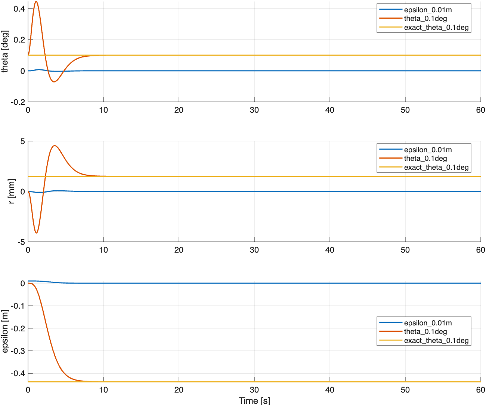

# 加入 epsilon 后的极点配置与相对平衡

## 定义与实现

直线 +x 参考下，chi=psi，epsilon=yG，参考速度为 v。保持原有 12 状态模型。
新增 `balance_chi_epsilon` 模式，横向反馈顺序为
`[theta,r,sigma1,sigma_r,chi,epsilon]`，配置 6 个极点；纵向仍配置 4 个极点。
预设 `chi_epsilon_balance` 使用 mr=2.3 kg、BR=6.5、BP=0、v=2.375 m/s，
横向极点 `[-1.4,-1.6,-1.8,-2,-2.2,-2.4]`，纵向 `[-0.8,-0.95,-1.05,-1.2]`。
控制律仍为 `u=-K*(x-x_ref(t))`，未启用 gamma 严格零约束。

设计中沿用线性约束 `sigma3=a*theta`，其中 `a=A(3,1)`，只在约束子空间配置横向极点。
完整模型保留全部状态。`sigma3-a*theta` 是滚动参考处的线性不变量，不能直接称作完整非线性系统的守恒量。
加入 epsilon 后，原本自由的横向位置方向受到反馈，但仍保留这个线性不变量方向和 xG 平移方向。
因此完整闭环仍有两个零极点；六个横向负极点不证明完整系统所有状态收敛到原点。

## 精确非线性相对平衡族

下面不依赖小角度近似。假定本预设的 BP=0、gamma=0、无限幅。
任取接近零的常数侧倾 alpha，令

- `theta=alpha`、`psi=0`、`gamma=0`；
- `sigma2=v/R`，`sigma1=sigma3=sigma_r=sigma_g=0`；
- `phi=v*t/R`、`xG=v*t+x_offset`；
- `r=C*tan(alpha)`，其中 `C=[R*(mr+mp+mw)+h*mp]/mr`；
- `F=mr*g*sin(alpha)`、`M2=0`。

代入 `model_residual` 的第 4 行得到 F，第 1 行得到 r；其余三行均为零。
运动学给出 `theta_dot=r_dot=psi_dot=gamma_dot=yG_dot=0`。
为了让状态反馈恰好产生该 F，取

`epsilon = [-mr*g*sin(alpha)-K(1,7)*alpha-K(1,9)*C*tan(alpha)]/K(1,12)`。

纵向误差为零，因此 M2=0。这给出以 alpha 和 x_offset 为参数的精确闭环相对平衡族。
在随参考匀速移动、同时减去参考轮转角的误差坐标中，它们就是平衡点。
在原始坐标中 phi 和 xG 随时间增长，所以它们不是静止的 `xdot=0` 平衡点。

**结论：加入 epsilon 反馈后，仍存在非零侧倾、非零杆位移、非零横向偏移的闭环相对平衡。**
这个结论由精确解成立，不仅来自零特征值。这里没有穷举大角度、限幅或其他参数下的所有平衡。
也没有证明整个平衡族的非线性稳定性或吸引域。

## 验证方式

在 `MATLAB/Full` 运行：

```matlab
addpath('analysis');
report=verify_epsilon_equilibria();
```

该函数检查：六阶极点配置、完整闭环两个零极点、alpha 为 ±1°、±0.1°、0° 时
在 t=0、2、10 s 的完整非线性相对平衡残差，以及 xG 任意平移不改变解。
随后运行三组 60 s 非线性仿真：仅 epsilon=0.01 m、仅 theta=0.1°、精确平衡族上 theta=0.1°。
所有组使用相同控制器，单独记录末端误差、末段 epsilon 波动和相对平衡残差。

## MATLAB 数值结果（2026-09-27）

完整闭环的两个零特征值验证通过。五个精确解的最大方程残差为 `1.15e-16`。

| 60 s 初值试验 | 最终 theta [°] | 最终 r [m] | 最终 epsilon [m] |
|---|---:|---:|---:|
| 仅 epsilon=0.01 m | 5.76e-12 | 8.64e-14 | -2.52e-11 |
| 仅 theta=0.1° | 0.099997 | 0.0014997 | -0.43746 |
| 精确平衡 theta=0.1° | 0.1 | 0.0014997 | -0.43747 |

三组均完成 60 s，无侧倾终止，末端相对平衡残差小于 `3.3e-12`。
后两组最终 chi 约为 `1e-12` 度，说明航向回零并不排除平行于参考线的横向偏移。
纯 epsilon 扰动能消除，但独立 theta 扰动在此试验中收敛到非零相对平衡。
该数值现象与解析平衡族一致，不应把这一组测试推广为任意初值的收敛保证。

结果存于 `MATLAB/Full/results/epsilon_equilibria/`：`equilibria.csv`、`simulations.csv` 和包含轨迹的 `verification.mat`。



两个日常入口、六阶极点的单元素扫描及无效字段拒绝检查均通过；原有实验与 chi 控制器回归也通过。
日常预设仍保留 theta0=1°，所以默认 epsilon 扫描同时带着该侧倾初值；
上表的“仅 epsilon”试验则显式设置 theta0=0，以隔离扰动来源。
