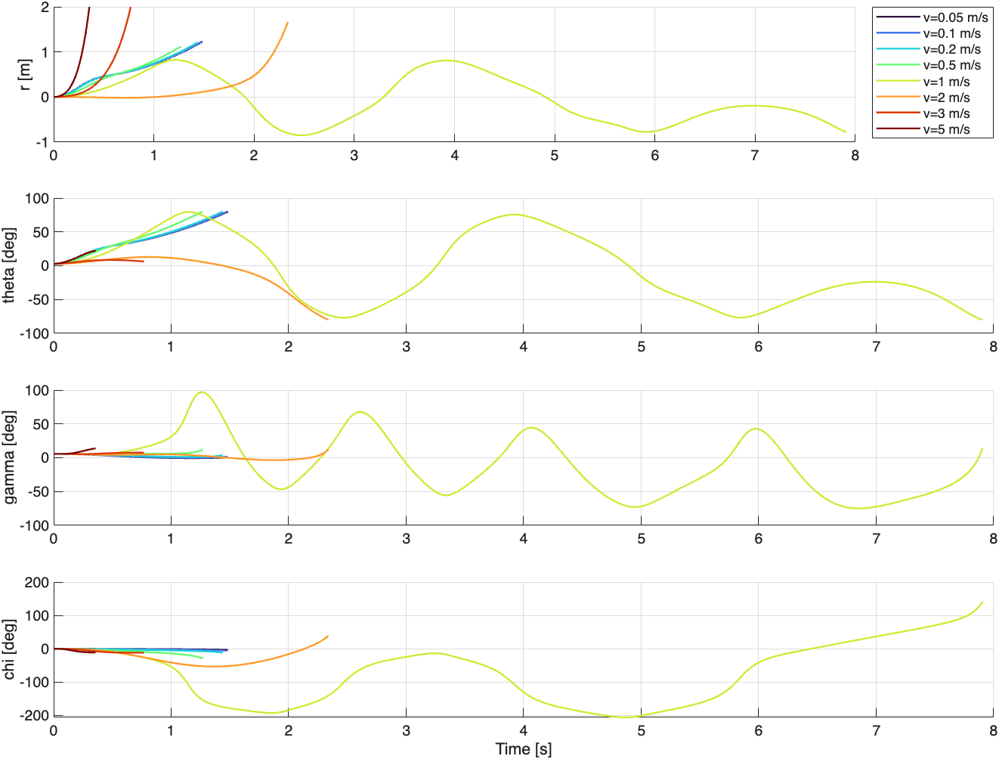
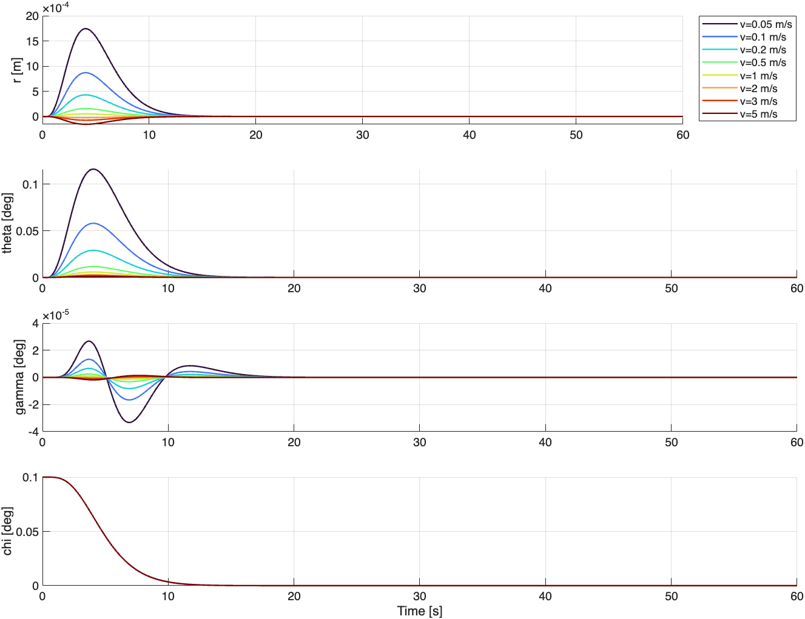

# Full model：杆阻尼 b=6.5、近原点极点及不同速度的稳定性测试

## 结论

杆的粘性阻尼已在完整模型中实现，原参数 `BR=0`；本次已将 `config/model_parameters.m` 的 `BR` 设为 **6.5 N·s/m**，没有重复添加阻尼力。期望极点设置在左半平面 **−1 s⁻¹ 附近**
在 0.05、0.1、0.2、0.5、1、2、3、5 m/s 的每个速度上，重新线性化并生成对应控制器。9 个指定极点全部配置成功，但全模型还保留 3 个零极点。使用当前配置初值（侧倾 2.8°、gamma=0.1 rad）时，**8 组均未通过非线性稳定性测试**。使用零侧倾、零俯仰、0.1° 航向误差的小扰动时，8 组均完成 60 s 并满足本文的末段收敛判据。

因此，这组慢极点不能作为当前配置初值下已稳定的控制参数；小扰动测试通过也不等于完整 12 维系统渐近稳定。

## 1. 状态、输入和符号

完整模型状态顺序不变：

$$
x=[\sigma_1,\sigma_2,\sigma_3,\sigma_r,\sigma_g,
\psi,\vartheta,\phi,r,\gamma,x_G,y_G]^T,
\qquad u=[F,M_2]^T.
$$

代码中的 `theta` 表示侧倾角 $\vartheta$；$\chi$ 表示航向误差。参考直线沿 +x 轴，故本例 $\chi=\psi$。$r$ 为杆平移位移，单位 m；$\gamma$ 为俯仰角，配置文件单位 rad，图表单位 °。

实际运动学：

$$
\dot\vartheta=\sigma_1,\qquad
\dot r=R\sigma_1+\sigma_r,\qquad
\dot\psi=\frac{\sigma_3}{\cos\vartheta},\qquad
\dot\gamma=\sigma_g-\sigma_3\tan\vartheta.
$$

本次含 χ 的横向反馈向量为

$$
z_{lat}=[\vartheta,r,\sigma_1,\sigma_r,\chi]^T,
\qquad F=-K_{lat}z_{lat}.
$$

纵向反馈向量为

$$
z_{lon}=[\phi-\phi_{ref},\gamma,\sigma_2-v/R,\sigma_g]^T,
\quad \phi_{ref}(t)=vt/R,\quad M_2=-K_{lon}z_{lon}.
$$

设计参考是非零速度的直线滚动轨迹，而不是静止平衡点。前进速度为 $v=R\sigma_2$。参考 $x_{G,ref}=vt$ 同样随时间更新，但当前位置未直接加入反馈。

## 2. 杆阻尼确实作用于实际杆速度

`model/model_residual.m` 使用 $M(x)\dot\sigma+c(x,u)=0$。其中已有

$$
\begin{aligned}
c_1&\supset B_RR^2\sigma_1+B_RR\sigma_r=B_RR\dot r,\\
c_4&\supset B_RR\sigma_1+B_R\sigma_r=B_R\dot r.
\end{aligned}
$$

因此物理阻尼力为

$$
F_d=-b\dot r,\qquad b=B_R=6.5\ \mathrm{N\,s/m},
$$

而不是 $-b\sigma_r$。阻尼耗散功率为

$$
P_d=-b\dot r^2\leq0.
$$

扫描脚本对残差差值和耗散项都进行了数值断言。纵向阻尼 `BP` 保持 0，其余物理参数沿用现有完整模型（包括杆质量 2.3 kg、轮半径 0.253 m）。

还有一个与本次实验有关的区别：若每次都重新 pole placement、且输入不限幅，设计出的导数反馈会补偿这项阻尼。由当前输入映射可得

$$
K_{lat}(b)=K_{lat}(0)-b[0,0,R,1,0].
$$

于是 $F_b=F_0+b\dot r$；扣除物理阻尼后，理想模型的净杆驱动力与无阻尼重新设计时一致。因此“增加阻尼后再把极点配置到同一位置”并不自动改善稳定性。保持旧增益不变时则是另一项实验，本次没有将其混入速度扫描。

## 3. 极点选择、降阶及不可控模态

本次采用 `balance_chi`，使用无需 Control System Toolbox 的 Ackermann 公式：

$$
\Lambda_{lat}=\{-0.8,-0.9,-1.0,-1.1,-1.2\}\ \mathrm{s}^{-1},
$$

$$
\Lambda_{lon}=\{-0.8,-0.95,-1.05,-1.2\}\ \mathrm{s}^{-1}.
$$

静止 `balance` 模式的 4 个横向期望极点也更新为 $[-0.8,-0.95,-1.05,-1.2]$，但本报告速度扫描使用的是含 χ 的 5 状态模式。每个极点属于整个分块，不是某个状态独占一个极点。

对完整模型数值线性化，在每个非零速度处有

$$
\dot\sigma_3=a(v)\sigma_1,\qquad
I=\sigma_3-a(v)\vartheta,\qquad \dot I=0.
$$

这是线性化模型的不变量，不是任意幅度下的完整非线性守恒量。本模型 $a(v)\approx-3.30393642129v$，并非直接照搬简化论文的系数。横向设计在 $I=0$ 子空间内代入 $\sigma_3=a(v)\vartheta$，得到 5 阶可控分块；非线性仿真仍保留原来的全部 12 个状态。

完整闭环矩阵 $A-BK$ 还有 3 个零极点，因此不能声称整个系统渐近稳定。尤其当前配置初值 $\sigma_3(0)=0$、$\vartheta(0)=2.8°$，有 $I(0)\ne0$；在线性模型中不可能同时令 $\sigma_3$ 和 $\vartheta$ 都趋于零。在 0.2 m/s 时 $I(0)\approx0.0322922$ rad/s。本文的小扰动诊断初值特意取 $I(0)=0$。

此外，本控制器没有反馈横向位置 epsilon；航向收敛并不代表回到参考线上。零速度时 χ 的这一配置方式退化，故扫描不包含 v=0。

## 4. 0.2 m/s 下的数值设计

在 $b=6.5$、$v=0.2$ 时，按 $z_{lat}$ 顺序的降阶模型为

$$
A_{lat}=\begin{bmatrix}
0&0&1&0&0\\
0&0&0.253&1&0\\
27.851776&-46.731198&-0.861717&-3.405995&0\\
-9.677843&0&-0.715&-2.826087&0\\
-0.660787&0&0&0&0
\end{bmatrix},\quad
B_{lat}=\begin{bmatrix}0\\0\\0.523999\\0.434783\\0\end{bmatrix}.
$$

增益如下（负号已放在控制律中，角度以 rad 进入控制器）：

```text
K_lat = [-279.4959224 303.9271633 -27.18873097 35.78585792 0.07078898284]
K_lon = [-0.01767859595 -0.7948442818 -0.07227621465 -0.09070609059]
```

各速度的横向增益，顺序为 `[theta, r, sigma1, sigma_r, chi]`：

| v (m/s) | K_theta | K_r | K_sigma1 | K_sigma_r | K_chi |
|---:|---:|---:|---:|---:|---:|
| 0.05 | -302.9763 | 326.4066 | -29.19509 | 38.20392 | 0.2831559 |
| 0.1 | -298.06 | 321.7074 | -28.77567 | 37.69843 | 0.141578 |
| 0.2 | -279.4959 | 303.9272 | -27.18873 | 35.78586 | 0.07078898 |
| 0.5 | -185.3525 | 212.5349 | -19.03168 | 25.955 | 0.02831559 |
| 1 | -54.33627 | 75.66316 | -6.81544 | 11.23201 | 0.0141578 |
| 2 | -7.987426 | -30.61344 | 2.670086 | -0.1999303 | 0.007078898 |
| 3 | -89.67644 | -60.94944 | 5.37767 | -3.463105 | 0.004719266 |
| 5 | -437.1229 | -78.55803 | 6.949293 | -5.357222 | 0.002831559 |

纵向线性分块在这组直线滚动速度下不随速度变化，故纵向增益相同。9 个指定极点在全部速度上的最大匹配误差为 2.7e-08 s⁻¹。完整 A、B、增益、实际极点和参考轨迹参数保存于 `designs.json` 和 `study.mat`。

## 5. 扫描条件与判据

- 每个速度分别重新线性化、生成 K；初始速度等于设计/参考速度。不代表一个固定 K 覆盖全部速度，也不是一次连续变速实验。
- 时长上限 60 s；`RelTol=1e-8`，`AbsTol=1e-10`，`MaxStep=0.01 s`，输出间隔 0.02 s。
- 保留原有 80° 侧倾终止。仅扫描脚本额外在 $|r|=2$ m 时停止，防止发散后发生矩阵病态和数值溢出；2 m 是数值发散保护，不是硬件行程限制，也不施加碰撞或限位力。
- 力和力矩无限幅，没有另加物理行程约束；峰值是输出采样及终止点上的峰值。
- “通过收敛判据”：完整跑到 60 s，且最后 10 s 内 $|\vartheta|,|\gamma|,|\chi|<0.1°$、$|r|<1$ mm、$|R\sigma_2-v|<0.001$ m/s。该判据是有限时间仿真检查，非非线性稳定性证明，也不检验横向位置收敛。

### A. 当前配置初值

$\vartheta_0=2.8°$，$r_0=0$，$\gamma_0=0.1$ rad $\approx5.72958°$；其余角度及初始角速度/杆速度为 0；初始前进速度为对应 v。

| v (m/s) | 终止时间 (s) | 原因 | 峰值 \|r\| (m) | 峰值 \|theta\| (°) | 峰值 \|gamma\| (°) | 结果 |
|---:|---:|---|---:|---:|---:|---|
| 0.05 | 1.483969 | 侧倾达到 80° | 1.228017 | 80.00000 | 5.72958 | 未通过 |
| 0.1 | 1.474342 | 侧倾达到 80° | 1.224735 | 80.00000 | 5.72958 | 未通过 |
| 0.2 | 1.439010 | 侧倾达到 80° | 1.211592 | 80.00000 | 5.72958 | 未通过 |
| 0.5 | 1.269356 | 侧倾达到 80° | 1.118580 | 80.00000 | 12.27279 | 未通过 |
| 1 | 7.905882 | 侧倾达到 80° | 0.848228 | 80.00000 | 97.06907 | 未通过 |
| 2 | 2.337998 | 侧倾达到 80° | 1.666894 | 80.00000 | 12.34782 | 未通过 |
| 3 | 0.769075 | 杆位移达到 2 m | 2.000000 | 8.50020 | 7.51121 | 未通过 |
| 5 | 0.356503 | 杆位移达到 2 m | 2.000000 | 22.04229 | 13.87342 | 未通过 |

这组慢极点在当前配置初值下没有给出可接受的恢复过程。尤其不能把 3、5 m/s 的侧倾暂未达到 80° 解读为稳定，杆位移已经发散到测试终止阈值。



### B. 小航向扰动诊断

取 $\vartheta_0=r_0=\gamma_0=0$、$\chi_0=0.1°$，其余初始角速度/杆速度为 0；初始前进速度为对应 v。此时初始线性不变量 I=0。此测试用于确认相容小扰动下的响应，不能代替 A 组初值测试。

| v (m/s) | 时长 (s) | 峰值 \|r\| (mm) | 峰值 \|theta\| (°) | 峰值 \|gamma\| (°) | 末段判据 |
|---:|---:|---:|---:|---:|---|
| 0.05 | 60 | 1.744166 | 0.116228 | 3.324e-05 | 通过 |
| 0.1 | 60 | 0.869289 | 0.058100 | 1.659e-05 | 通过 |
| 0.2 | 60 | 0.429448 | 0.029048 | 8.248e-06 | 通过 |
| 0.5 | 60 | 0.157299 | 0.011619 | 3.171e-06 | 通过 |
| 1 | 60 | 0.052798 | 0.005809 | 1.364e-06 | 通过 |
| 2 | 60 | 0.025310 | 0.002905 | 4.283e-07 | 通过 |
| 3 | 60 | 0.074321 | 0.001936 | 8.389e-07 | 通过 |
| 5 | 60 | 0.154873 | 0.001162 | 1.819e-06 | 通过 |



## 6. 验证与复现

MATLAB R2026a 实测。阻尼增益恒等式误差为 2.62e-13。在 0.2 m/s 的 A、B 两组案例中，将最大步长和输出间隔减半、误差容限缩小 10 倍复算：A 组侧倾终止时间差 7.21e-11 s；B 组末端状态无穷范数差 3.88e-12（各状态沿用各自 SI 单位）。这支持代表性结果不是时间步长导致的误判。

运行入口：

```matlab
% 在 MATLAB/Full 目录下
run_damping_speed_study
```

脚本会覆盖本次实验输出目录 `MATLAB/Full/results/damping_speed_study/` 中的同名结果文件。当前初值仍由 `simulation_settings.m` 读取；小扰动组在扫描脚本中显式定义。完整物理参数、设置、轨迹、输入与控制器都保存在 MAT 文件中。

- [summary.csv](../../MATLAB/Full/results/damping_speed_study/summary.csv)：全部 16 组结果、峰值、末值、末段指标、极点误差和初始不变量。
- [study.mat](../../MATLAB/Full/results/damping_speed_study/study.mat)：完整仿真数据和本次实际参数快照。
- [designs.json](../../MATLAB/Full/results/damping_speed_study/designs.json)：各速度的完整线性模型与控制器信息。
- [verification.json](../../MATLAB/Full/results/damping_speed_study/verification.json)：阻尼增益和步长复核结果。

原控制器/扫描回归检查以及专用 χ 控制器回归检查均通过。χ 回归用固定的旧设计参数作为功能基准；本报告的新慢极点性能由上述 16 组测试评价，不能用旧回归通过替代。

当前代码已保留 b=6.5 和上述慢极点，因此直接运行 `run_chi_simulation.m` 会使用这些新参数及当前配置初值；在默认 0.2 m/s 时预计约 1.439 s 达到 80° 侧倾终止。这是已测到的控制效果，不是仿真入口失效。

若下一步要求从当前初值恢复，应重新评估非零初始不变量、所选反馈结构和极点速度；不能仅凭 9 个负实部极点判断完整系统稳定。


## 补充：χ 与侧倾初值不能等同处理

在用户将配置初速改为 0 后复核。控制器参考速度仍为 0.2 m/s；没有在脚本内改写用户初值。下面每组都单独指定初值，gamma0=0，其余未列出的姿态/速率为零；使用 b=6.5 和上述慢极点，仿真上限 60 s。

| 初速 (m/s) | χ0 (°) | theta0 (°) | 结果 |
|---:|---:|---:|---|
| 0 | 0.1 | 0 | 跑完 60 s；峰值侧倾 1.237°、gamma 22.934°；末端 χ≈−0.00917° |
| 0.2 | 0.1 | 0 | 跑完 60 s；峰值侧倾 0.02905°；末端 χ≈−6.03×10⁻⁹° |
| 0.2 | 0 | 0.01 | 跑完 60 s，但不回零：末端 theta≈0.01001°、χ≈−0.59699°；峰值侧倾 0.77224° |
| 0.2 | 0 | 0.1 | 约 3.86765 s 达到 80° 侧倾终止 |
| 0 | 0 | 0 | 横向保持零，但因从静止跟踪 0.2 m/s，gamma 峰值达 22.934° |
| 0.2 | 0 | 0.1 | 另设 psi_dot0=−0.00115329 rad/s，使初始线性不变量为零；仍在约 3.99756 s 达到侧倾终止 |

最后一组表明，不能把 θ 扰动的失败仅归因于初始不变量不为零。即便初始满足降阶约束，这组慢极点下的非线性恢复范围仍有限；微小扰动可能有较大的瞬态放大。不能通过强行给初始 yaw rate 配值来宣称问题已经解决。

单独 χ 扰动与单独 θ 扰动对应不同状态方向，不能把一个方向上的成功扩展为整个邻域稳定的证明。现有设计也没有完整 12 维渐近稳定性保证。修改初速使其等于设计速度可以分离加速瞬态，但不能单独解决 θ 扰动失败。

配置文件所有角度均为 rad：例如 0.1° 应写 `0.1*pi/180`，直接写 `0.1` 是 5.73°。运行 `run_chi_simulation.m` 时，现在会打印实际初始角度和初速，以及设计/参考速度，便于确认此次究竟在测试什么。

复现函数：`analysis/diagnose_chi_initial_conditions.m`，返回六组指标；数据存于 [initial_condition_diagnostic.csv](../../MATLAB/Full/results/damping_speed_study/initial_condition_diagnostic.csv)。本补充测试没有修改 `simulation_settings.m` 或用户选择的极点。


## 补充：初速=目标速度=0.2 m/s，gamma 全程为零

按用户要求，在 `run_chi_simulation.m` 中让设计/目标速度读取初速，并启用 gamma 零约束；本次初速按用户选择设为 0.2 m/s。运行前读取的模型文件已将 BR 改为 0，本次沿用该值，不应与前面 b=6.5 的速度扫描混为同一次实验。横向期望极点仍为 −0.8、−0.9、−1、−1.1、−1.2；仿真时长沿用当前配置的 15 s。

### 约束的实现

完整动力学不变，由

$$
\dot\gamma=\sigma_g-\sigma_3\tan\theta
$$

得到

$$
\ddot\gamma=\dot\sigma_g-\dot\sigma_3\tan\theta
-\sigma_3\sigma_1\sec^2\theta.
$$

对给定横向力 F，动力学关于 M2 是仿射的，写成 $\ddot\gamma=\alpha(x,F)+\beta(x)M_2$。用完整模型分别计算零力矩、单位力矩的响应，求取 alpha、beta，然后选

$$
M_2=\frac{-2\omega_c\dot\gamma-\omega_c^2\gamma-\alpha}{\beta},
\qquad \omega_c=10\ \mathrm{s}^{-1}.
$$

因此 gamma=gamma_dot=0 的初值在精确模型中保持不变；校正项用于抑制积分数值漂移。没有把 gamma 的积分结果或图线手工改成 0。要求力矩无限幅且 beta 非零；这是理想模型诊断，不是实际执行器能力的验证。

原纵向 pole placement 被这个力矩约束替代，不再做速度调节。设计速度等于初速不代表实际速度始终不变；例如失稳组末端速度约 0.211539 m/s。设计信息中的实际纵向/完整闭环极点已经按新控制律重算，原纵向极点仅作为未启用的设计信息保留。

### 本次脚本测试结果

| 初始状态 | 结束时间 (s) | 末端 theta (°) | 末端 chi (°) | 峰值 abs(gamma) (°) | 观察 |
|---|---:|---:|---:|---:|---|
| 当前配置：chi=theta=0 | 15 | 0 | 0 | 0 | 保持直线滚动 |
| 仅 chi0=0.1° | 15 | 0.000132 | 0.000124 | 4.24e-19 | 已恢复到很小误差 |
| 仅 theta0=0.01° | 15 | 0.006061 | −0.600268 | 1.10e-15 | 未回到目标零状态 |
| 仅 theta0=0.1° | 3.849379 | 80 | −19.94467 | 5.91e-10 | 触发侧倾终止 |

因此，限制 gamma 摆动没有消除慢极点设计下的侧倾恢复问题。单独 chi 扰动和单独侧倾扰动仍需区别评价。

`test_initial_perturbations=true` 会在运行脚本中叠加上述三组扰动测试；设为 false 只运行当前配置初值。theta/chi 初值的单位换算都在脚本中明确写为 `*pi/180`。gamma0 和 gamma_dot0 被显式设置为 0；其他配置初值仅在额外隔离扰动组中按注释调整。

验证：`tests/test_gamma_zero.m` 已验证非零姿态/角速度下的约束加速度恒等式，以及静止/滚动积分时 gamma 和 gamma_dot 的误差。
