# Full Model Simulation Report: Open-Loop Oscillations and Pole-Placement Tolerance

Updated: 2026-09-22. Four open-loop cases and 130 closed-loop simulations. Closed-loop initial perturbations are limited to **theta, r, and chi**.

## Table of Contents

- [1. Lateral Open Loop: Rod Mass 0.272 kg](#open-0272)
- [2. Lateral Open Loop: Rod Mass 1 kg](#open-1)
- [3. Lateral Open Loop: Rod Mass 2.3 kg](#open-23)
- [4. Damped Lateral Open Loop: Rod Mass 0.272 kg](#open-damped)
- [5. 2.375 m/s: Initial Lean Tolerance vs. Pole Location](#v-2.375-tolerance)
- [6. 2.375 m/s: Initial theta Responses](#v-2.375-theta)
- [7. 2.375 m/s: Initial r Responses](#v-2.375-r)
- [8. 2.375 m/s: Initial chi Responses](#v-2.375-chi)
- [9. 1 m/s: Initial Lean Tolerance vs. Pole Location](#v-1-tolerance)
- [10. 1 m/s: Initial theta Responses](#v-1-theta)
- [11. 1 m/s: Initial r Responses](#v-1-r)
- [12. 1 m/s: Initial chi Responses](#v-1-chi)
- [13. Why Initial Lean Can Leave a Steady Offset](#lean-offset-proof)

## Experimental Settings

- **Open-loop comparison:** initial speed 2.375 m/s, theta0=1°, all other initial perturbations zero. Lateral actuator force F=0; longitudinal gamma PD remains active, `M2=3*gamma+0.8*gamma_dot`. Speed is not held constant by this PD controller. Rod masses are 0.272, 1, and 2.3 kg without damping, plus 0.272 kg with b=6.5 N·s/m.
- **Closed-loop comparison:** rod mass **2.3 kg**, viscous rod damping **b=6.5 N·s/m**, and BP=0. Initial and reference speeds match at either **2.375 or 1 m/s**. The Jacobian and gains are recomputed at each speed and pole setting. There is no gamma-zero constraint; longitudinal pole-placement feedback remains active.
- **Pole locations:** the five lateral poles are `alpha * [-0.8, -0.9, -1, -1.1, -1.2]`, with alpha initially 0.5, 1, and 2. Thus “near -2” means `[-1.6, -1.8, -2, -2.2, -2.4]`. The longitudinal poles remain `[-0.8, -0.95, -1.05, -1.2]` to isolate the effect of lateral pole placement. Gains include the specified damping.
- **Directional search:** if a direction improves the largest tested theta that satisfies the near-zero criterion, extend the pole scale by another factor of two. Stop when that score no longer improves (at most four extensions). This is a coarse search, not a global optimization or an exact tolerance boundary.
- **Initial conditions:** theta = 0.00001°, 0.0001°, 0.001°, 0.01°, 0.1°, 1°, or 5°; r = 1, 5, or 10 mm; chi = 1°, 5°, or 10°. Only one initial condition is perturbed per run; gamma and all initial rates are zero. For the straight reference path along the x axis, chi=psi.
- **Numerics and limits:** duration 30 s, output interval and maximum step 0.01 s, relative tolerance 1e-8, absolute tolerance 1e-10. Stop at |r|=0.5 m, |theta|=80°, or |gamma|=80°. These are screening thresholds, not contact mechanics. Actuator force and torque are unlimited. JR stays fixed at 0.0517629 kg·m² when mass varies; this is a parameter study, not an exact reconstruction of Mate's hardware.

**Reading the tolerance maps:** green = near zero throughout the last 5 s (|theta|, |chi|, |gamma| < 0.1° and |r| < 1 mm); yellow = completed 30 s but failed that criterion; red = stopped at a threshold. A green result is a finite-time numerical criterion, not proof of asymptotic stability. Reported maxima are the largest **tested** values, not certified limits. All theta tests use positive initial angles. Response-panel vertical axes are scaled independently; compare their tick values as well as curve shapes.

## 1. Lateral Open Loop: Rod Mass 0.272 kg

Lean angle and rod displacement exhibit persistent oscillations without reaching a stopping threshold within 30 s. The heading psi continues to drift. These results reproduce lateral oscillations, but do not demonstrate stable straight-line heading.

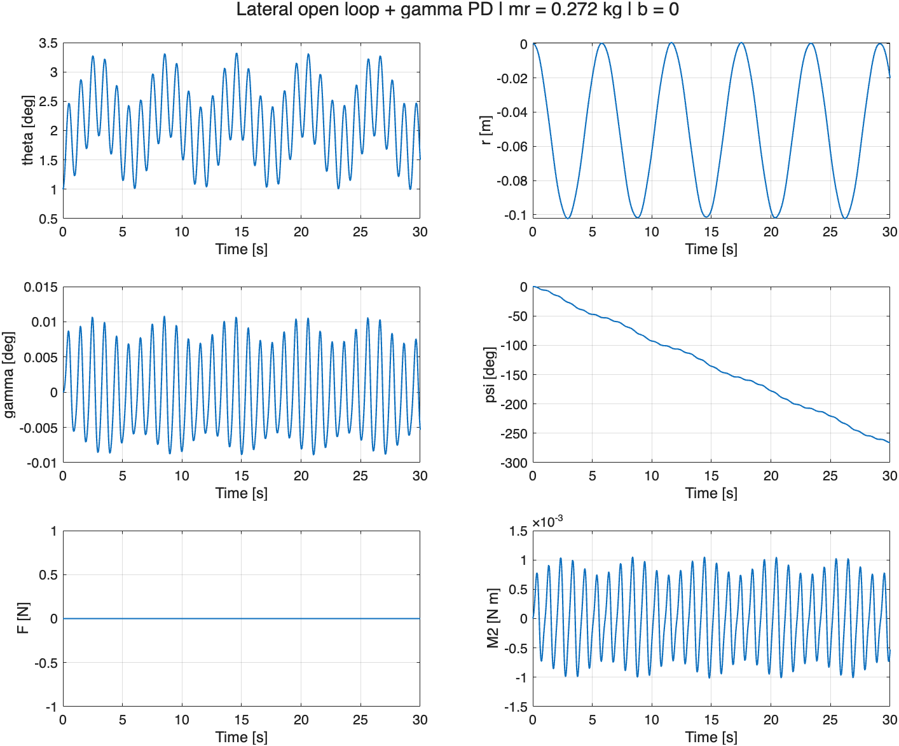

## 2. Lateral Open Loop: Rod Mass 1 kg

Oscillations remain, with a noticeably smaller rod-displacement amplitude than in the 0.272 kg case. Heading drift persists.

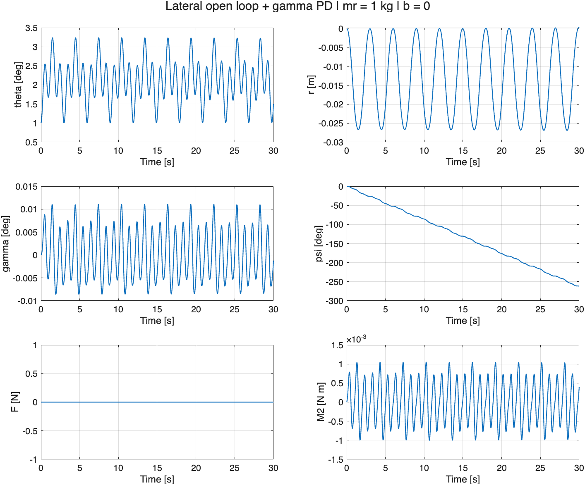

## 3. Lateral Open Loop: Rod Mass 2.3 kg

The rod-displacement amplitude decreases further, while lean oscillations remain. Together, the three cases show that open-loop oscillations can occur without rod damping and that rod mass changes the oscillation pattern.

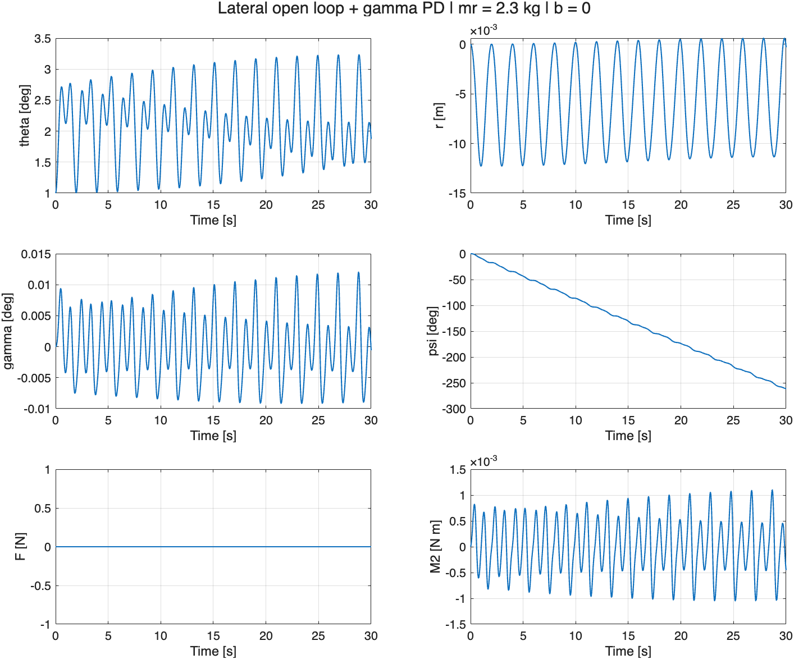

## 4. Damped Lateral Open Loop: Rod Mass 0.272 kg

This case uses **b=6.5 N·s/m**, with all other conditions matching Section 1: initial speed 2.375 m/s, theta0=1°, F=0, and longitudinal gamma PD control. The damping force is passive; the plotted F is the commanded actuator force and remains zero.

The simulation completes 30 s. Lean oscillations persist, with a peak of approximately **2.64°**. The large, slow rod-displacement oscillation seen without damping is suppressed; r instead drifts to approximately **-0.0385 m**. Heading still drifts, reaching approximately **-216.3°**. Damping changes the response but does not restore straight-line heading or zero lean.

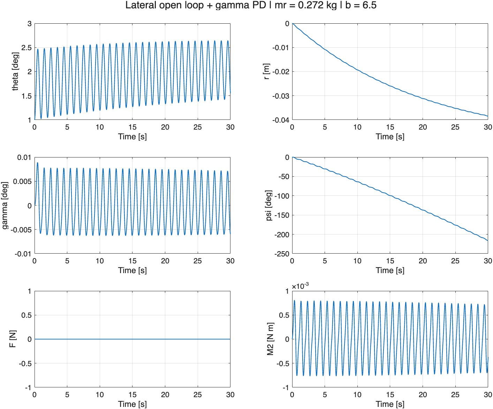

## 5. 2.375 m/s: Initial Lean Tolerance vs. Pole Location

| Lateral pole center | Largest tested theta completing 30 s | Largest tested theta near zero |
| --- | --- | --- |
| -0.5 | 0.0001° | None in tested grid |
| -1 | 0.01° | 1e-05° |
| -2 | 1° | 0.001° |
| -4 | 1° | 0.001° |

The largest tested near-zero theta is **0.001°**, achieved with lateral poles near **-2, -4**. Search extensions: extended 2 to 4; largest near-zero theta 0.001 to 0.001 deg.

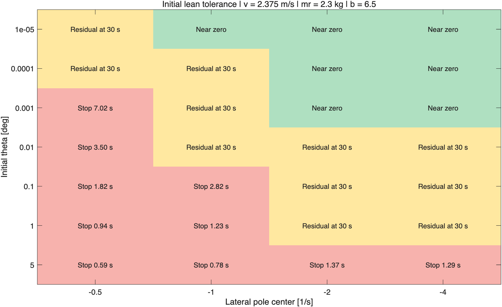

## 6. 2.375 m/s: Initial theta Responses

Each column uses a different lateral pole location. Curves ending early reached a stopping threshold; the legend gives the stopping time. A completed curve can retain nonzero lean, rod displacement, or heading. The tolerance map above distinguishes these residuals from recovery.

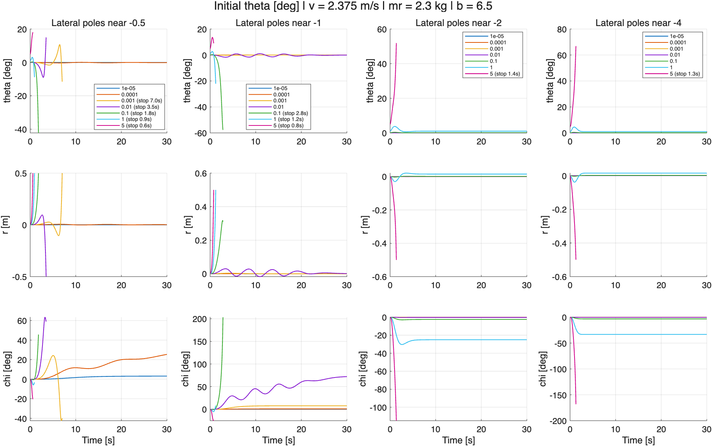

## 7. 2.375 m/s: Initial r Responses

Initial r values are 1, 5, and 10 mm. near -0.5: 0/3 near zero, 3/3 stopped; near -1: 1/3 near zero, 2/3 stopped; near -2: 3/3 near zero; near -4: 3/3 near zero.

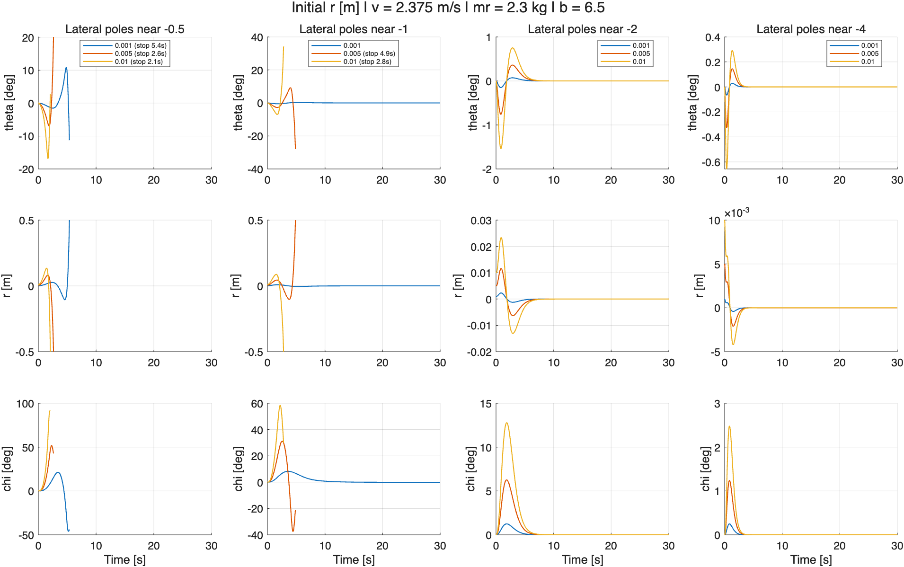

## 8. 2.375 m/s: Initial chi Responses

Initial chi values are 1°, 5°, and 10°. near -0.5: 1/3 near zero; near -1: 3/3 near zero; near -2: 3/3 near zero; near -4: 3/3 near zero.

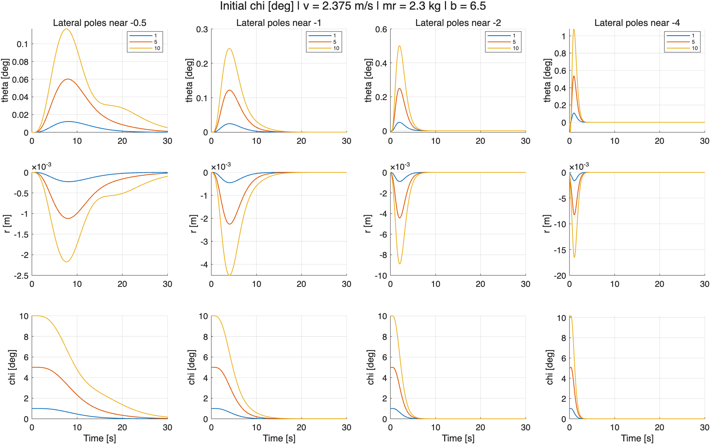

## 9. 1 m/s: Initial Lean Tolerance vs. Pole Location

| Lateral pole center | Largest tested theta completing 30 s | Largest tested theta near zero |
| --- | --- | --- |
| -0.5 | 0.0001° | None in tested grid |
| -1 | 0.01° | 1e-05° |
| -2 | 0.1° | 0.0001° |
| -4 | 1° | 0.001° |
| -8 | 5° | 0.01° |
| -16 | 1° | 0.01° |

The largest tested near-zero theta is **0.01°**, achieved with lateral poles near **-8, -16**. Search extensions: extended 2 to 4; largest near-zero theta 0.0001 to 0.001 deg; extended 4 to 8; largest near-zero theta 0.001 to 0.01 deg; extended 8 to 16; largest near-zero theta 0.01 to 0.01 deg.

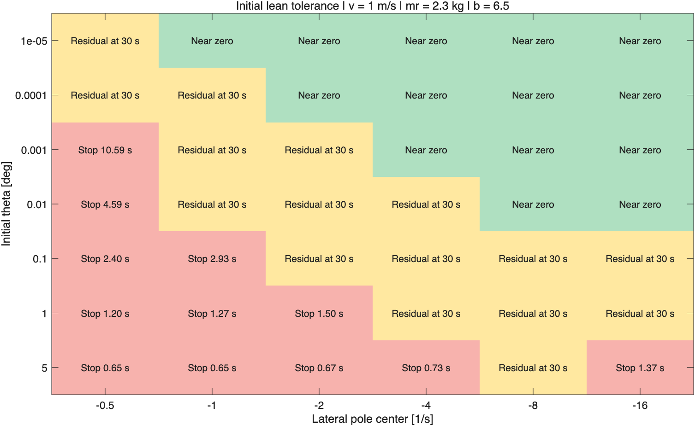

## 10. 1 m/s: Initial theta Responses

Each column uses a different lateral pole location. Curves ending early reached a stopping threshold; the legend gives the stopping time. A completed curve can retain nonzero lean, rod displacement, or heading. The tolerance map above distinguishes these residuals from recovery.

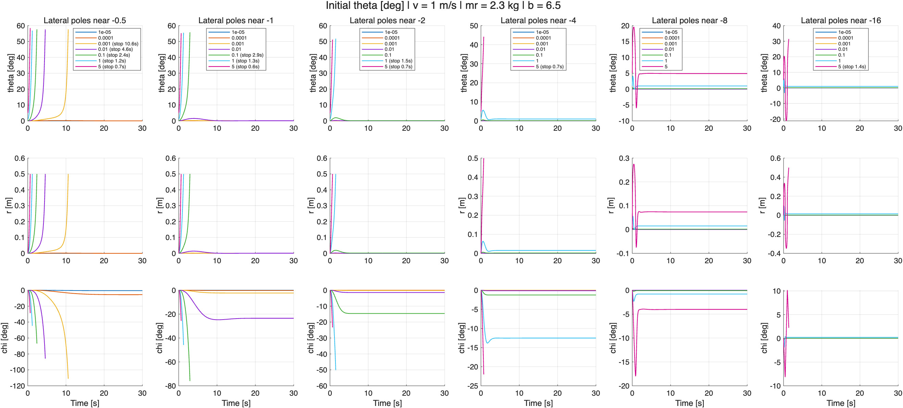

## 11. 1 m/s: Initial r Responses

Initial r values are 1, 5, and 10 mm. near -0.5: 0/3 near zero, 3/3 stopped; near -1: 0/3 near zero, 2/3 stopped; near -2: 2/3 near zero; near -4: 3/3 near zero; near -8: 3/3 near zero; near -16: 3/3 near zero.

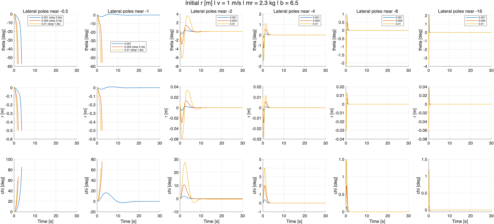

## 12. 1 m/s: Initial chi Responses

Initial chi values are 1°, 5°, and 10°. near -0.5: 2/3 near zero; near -1: 3/3 near zero; near -2: 3/3 near zero; near -4: 3/3 near zero; near -8: 3/3 near zero; near -16: 2/3 near zero, 1/3 stopped.

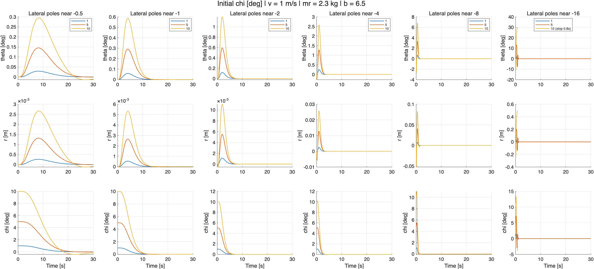

## Interpretation and Reproduction

Evaluate both the near-zero criterion and the r/chi disturbance responses when comparing pole locations; completing 30 s alone does not establish recovery. These results assume unlimited actuation; they do not establish a hardware operating envelope.

Run [run_report_experiments.m](../../MATLAB/Full/run_report_experiments.m) to regenerate the open-loop figures and the focused closed-loop study. To rerun only the closed-loop study, use [run_pole_tolerance_study.m](../../MATLAB/Full/run_pole_tolerance_study.m). The default is a fresh run; `run_pole_tolerance_study(true)` reuses saved cases and should only be used when the experimental settings have not changed.

Data: [Closed-loop summary CSV](figures/pole_tolerance/summary.csv) · [Complete closed-loop MAT file](figures/pole_tolerance/experiments.mat) · [Adaptive search log](figures/pole_tolerance/decisions.txt). The earlier gamma, derivative, and speed-offset figures are no longer included in this report.

## 13. Why Initial Lean Can Leave a Steady Offset

**Notation:** The paper's lean angle is \(\vartheta\) (`theta` in the code), wheel spin angle is \(\varphi\), and heading angle is \(\psi\). For the straight reference along +x, \(\chi=\psi\). The wheel angular-velocity components (in rad/s) are

\[
\omega_1=\dot{\vartheta},\qquad
\omega_2=\dot{\varphi}+\dot{\psi}\sin\vartheta,\qquad
\omega_3=\dot{\psi}\cos\vartheta.
\]

\[\omega_2\approx\dot{\varphi}. \qquad \omega_3\approx\dot{\psi}\]

At the upright straight-rolling operating point, \(\omega_{2*}=\dot{\varphi}_*=v_0/R\) and \(\omega_{3*}=0\). For \(v_0=2.375\) m/s and \(R=0.253\) m, these are approximately 9.39 rad/s and 0 rad/s, respectively. A nonzero but constant heading can still have omega3=0.

In [the paper](../../paper_src/2507.02700v1.pdf), the lateral state order is given in Eq. (61), p. 7. Rows 4 and 5 of Eq. (63), p. 8, give

\[
\dot{\vartheta}=\omega_1,\qquad
\dot{\omega}_3=a_{51}\omega_1,\qquad
 a_{51}=-2\dot{\varphi}_* \quad\text{[Eq. (64)]}.
\]

At a fixed linearization speed, a51 is constant. Subtracting these equations and integrating therefore yields

\[
\frac{d}{dt}(\omega_3-a_{51}\vartheta)=0,
\qquad \omega_3-a_{51}\vartheta=C.
\]

Near upright motion, sigma3 approximately equals psi_dot. For $\theta(0)=\theta_0$ and $\dot{\psi}(0)=0$,

\[
C=-a\theta_0,\qquad \dot{\psi}=a(\theta-\theta_0).
\]

Thus, if heading settles to a constant, $\dot{\psi}$ tends to zero and $\theta$ tends to $\theta_0$, not necessarily zero. Conversely, $\theta$ tending to zero would require a nonzero limiting heading rate when $a\theta_0$ is nonzero. Moving the assigned poles cannot remove this invariant. The current reduced controller is designed on C=0, whereas a pure initial lean perturbation generally has C nonzero. This explains the observed steady offsets; it is a fixed-speed linear-model limitation, not an exact conservation law or an impossibility result for the full nonlinear system.
