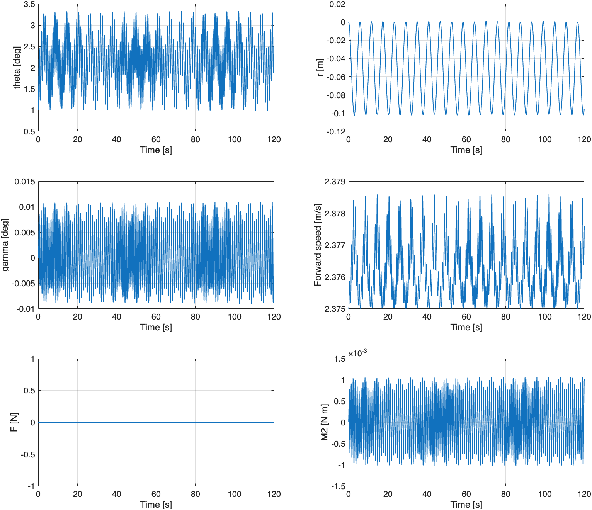
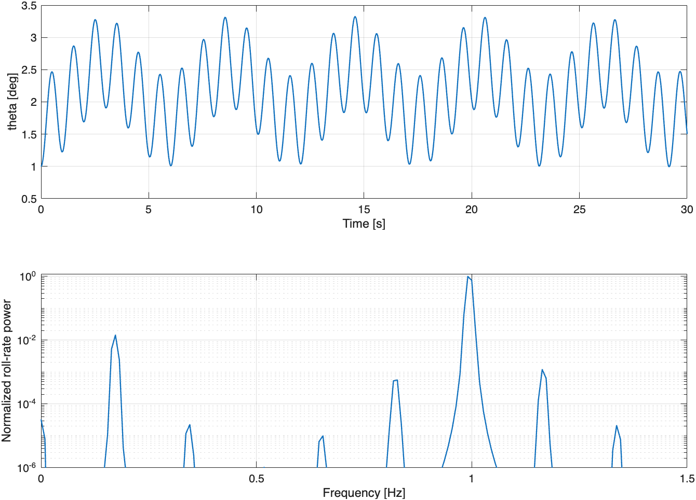

# Máté 会议所述开环振荡的复现尝试

## 结果：找到了持续有界的无阻尼横向振荡

完成 54 组非线性筛选、6 组 120 s 验证、3 组更小步长/更严格容限复算，并在相同初值下比较了全开环与纵向 PD 平衡。**无需添加杆阻尼，也无需改变原来的 gamma PD 增益，就能观察到两个频率叠加的持续横向振荡。**

最接近 Máté 提到的约 0.2 Hz、1 Hz 的候选配置：

| 参数 | 值 |
|---|---:|
| 横向输入 | F=0，严格开环 |
| 纵向控制 | M2=3*gamma+0.8*gamma_dot，角度输入单位 rad |
| 杆阻尼 / 纵向阻尼 | BR=0、BP=0 |
| 杆质量 mr | 0.272 kg |
| 杆惯量 JR | 0.0517629 kg·m²，保留当前模型值 |
| 初始前进速度 | 2.375 m/s |
| 初始侧倾 theta0 | 1° |
| 初始 gamma、psi、r | 全为 0 |
| 初始侧倾/杆/俯仰/偏航速率 | 全为 0 |
| gamma 目标与目标速率 | 全为 0 |
| 速度/位置反馈 | 无 |
| gamma 强制零约束 | 关闭；这是普通 PD 平衡 |

在 120 s 非线性验证中：最大侧倾 3.3293°，最大杆位移 0.10230 m，最大 gamma 0.01096°，前进速度范围 2.375～2.37859 m/s。10～40 s 与 90～120 s 两段的 theta 峰峰值之比约 1.0094，未出现明显的持续振幅增长。

线性模态频率约 **0.1768 Hz 和 1.0008 Hz**；非线性 120 s 轨迹的滚转角速度频谱峰值约 **0.1727 Hz 和 0.9908 Hz**。FFT 使用 10～120 s 数据、去均值及 Hann 窗，频率分辨率约 0.00909 Hz；有限幅度效应及频率分辨率会带来差异。





这里的“有界振荡”指有限时间内 theta、r 等状态保持有限振幅，gamma 保持平衡，**不等于 theta 收敛为零、航向/位置收敛或全状态渐近稳定**。曲线存在均值偏置，两个频率叠加也不必是严格周期运动。该候选复现了类似现象，尚不能称为精确复现 Máté 的模型与图。

## 之前为什么没有观察到同样的响应

### 1. 控制结构曾经不同

Máté 说的是横向开环、纵向仍平衡。此前 F=M2=0 的测试将纵向也完全放开；纵向倾倒或翻转会改变完整非线性耦合，不能直接比较。

本次固定 mr=1 kg、初速 2 m/s、theta0=1°、gamma0=0，只切换纵向控制：

| 纵向设置 | 时长 | 最大 theta | 最大 gamma |
|---|---:|---:|---:|
| M2=0 | 15 s | 6.9978° | 2158.66°，已连续翻转 |
| gamma PD，Kp=3、Kd=0.8 | 15 s | 6.9711° | 0.04790° |

这个比较说明纵向运行状态差异很大，但不意味着关闭纵向控制必然使侧倾立刻发散；该例两组都完成 15 s。需要同时查看 gamma，不能只看 theta 判断是否复现了会议工况。

### 2. 当前初值没有激发横向运动

本轮检查开始时配置为 mr=1 kg、theta0=0、gamma0=0.1 rad、初速 2 m/s，其余横向初值为零。该对称初值主要激发纵向运动；数值测试中 theta 和 r 始终为零，因此看不到横向振荡。应给侧倾角或侧倾角速度一个小扰动，而不是仅改变 gamma。

### 3. 5° 初始侧倾可能已经太大

同样 mr=1 kg、2 m/s，theta0=1° 能完成 120 s 有界振荡；theta0=5° 在初步筛选中约 1.538 s 达到 45° 侧倾终止阈值。该系统在某些速度附近有较大的暂态放大，线性无增长振荡模态不代表任意初始倾角都能保持有界。

轻杆候选 mr=0.272 kg、2.375 m/s 时，theta0=1° 可以运行 120 s；theta0=5° 则约 1.929 s 达到 0.5 m 杆位移筛选阈值。先用 0.1°～1° 观察自然模态更合适。

### 4. 速度和质量会改变自然频率

对 0.1～5 m/s（步长 0.025 m/s）的线性扫描，保留其余物理参数，仅改变 mr。找到约 0.2/1 Hz 的候选，是 mr=0.272 kg、v=2.375 m/s。保留 mr=1 kg 在同一速度也能稳定地观察振荡，但对应低频更接近 0.34 Hz。

这不是唯一可能参数组合，也不能由两个近似频率反推出 Máté 的全部参数。尤其本次改变 mr 时 **JR 没有同步缩放**；这是明确的参数敏感性试验，不是对同一根杆改变密度的物理建模。Máté 的准确质量、惯量、几何和增益仍需等其源码确认。

## 系统扫描与长期验证

筛选参数：mr=[0.272,1,2.3] kg；初速=[1.5,1.75,2,2.375,3] m/s；theta0=[0.1,1,5]°；初始 gamma=0。另加 gamma0=0.1 rad、四组纵向 PD 增益和当前配置对照，共 54 个独立案例。

30 s 筛选积分：RelTol=1e-8、AbsTol=1e-10、MaxStep=0.02 s、输出间隔 0.01 s。筛选保护在 |theta|=45°、|r|=0.5 m、|gamma|=30° 时终止。这些阈值只是避免无效数值发散，不表示模型加入了硬件限位或接触力。

严格的“振荡候选”判据：完整运行 30 s，峰值 theta<10°、gamma<5°、r<0.2 m，速度偏离初速不超过 10%；末段 theta 峰峰值>0.01°、至少 8 次侧倾角速度过零，20～30 s 与 10～20 s 振幅比在 0.5～2 之间。54 组中 21 组满足此判据。**不满足该筛选不等于已证明失稳**，例如 gamma0=0.1 rad 本身已超过 5°，或初始 5° 的案例峰值略超 10°。

随后挑选六组延长到 120 s，MaxStep=0.01 s，输出间隔 0.01 s。全部完成，结果如下：

| mr (kg) | v0 (m/s) | theta0 (°) | 最大 theta (°) | 最大 r (m) | 最大 gamma (°) | 后/前振幅比 | 频谱峰值 (Hz) |
|---:|---:|---:|---:|---:|---:|---:|---|
| 0.272 | 2.375 | 0.1 | 0.32237 | 0.009819 | 0.000104 | 0.9989 | 0.1727, 0.9999 |
| 0.272 | 2.375 | 1 | 3.32931 | 0.102296 | 0.010959 | 1.0094 | 0.1727, 0.9908 |
| 1 | 2.375 | 1 | 3.24148 | 0.028452 | 0.011073 | 0.8868 | 0.3363, 1.0090 |
| 1 | 3 | 5 | 10.52906 | 0.100422 | 0.115542 | 1.1213 | 0.3454, 1.4090 |
| 1 | 2 | 1 | 7.07430 | 0.055273 | 0.049719 | 1.0211 | 0.2727, 0.7454 |
| 2.3 | 2 | 1 | 6.37366 | 0.023938 | 0.038279 | 1.0136 | 0.4000, 0.7999 |

低频频谱搜索区间为 0.05～0.6 Hz，高频为 0.65～1.5 Hz；这些是本次指定频段的最大峰值，并非自动识别完整系统所有模态。

纵向增益测试还比较了 (Kp,Kd)=(3,0.8)、(6,0.8)、(6,1.6)、(12,2.4)。在 mr=0.272 kg、v0=2.375 m/s、theta0=1°、gamma0=0 下，四组均通过筛选；加强 PD 主要减小 gamma 振幅，theta 峰值约都为 3.323°。因此没有必要为了得到本次横向振荡而提高 PD 增益，最终沿用 (3,0.8)。

## 数值复核

对 mr=0.272 kg 的 0.1°、1° 两例，以及 mr=1 kg 的 1° 一例，最大步长从 0.01 缩小到 0.005 s，并将两项误差容限缩小 10 倍。120 s 全轨迹的最大侧倾差如下：

| 筛选案例编号 | 最大 theta 差 (°) |
|---:|---:|
| 10 | 1.408e-08 |
| 11 | 6.19e-08 |
| 26 | 5.984e-08 |

候选曲线对上述步长/容限变化不敏感。最终 run_simulation 预设也已按当前较细的 MaxStep=0.005 s 独立运行 60 s，验证 F 始终为零、BR=BP=0、gamma 零约束关闭。

## 如何直接运行

`MATLAB/Full/run_simulation.m` 顶部已设置：

```matlab
mate_test=true;
mate_case='oscillation_candidate';
```

该预设在脚本中显式设置 mr=0.272、v0=2.375、theta0=1°、gamma0=0、PD=(3,0.8)、时长 60 s，其余初始姿态及速率为零。JR 和其余模型参数沿用当前参数文件，控制律为横向 F=0、纵向 gamma PD。运行即可看到持续振荡及 psi 曲线。

- `mate_case='current_mass'`：使用同样的速度和初值，但保留 `model_parameters.m` 的杆质量。目前为 1 kg，该配置已验证 120 s。
- `mate_case='configured'`：保留配置文件的质量、初值和 PD 增益，只切换横向开环/纵向平衡结构及 BR=BP=0。
- `mate_test=false`：恢复完全按 `experiment_settings.m` 的模式执行。

此次调参不使用 pole placement，因此自然频率与配置文件中的期望极点没有关系。未启用 gamma 精确零约束，也没有速度反馈；速度仅在这个小扰动案例中变化很小。

## 复现脚本与数据

```matlab
% MATLAB/Full 目录
run_mate_oscillation_study
addpath('analysis')
validate_mate_oscillations
scan_mate_modes
```

这些脚本会覆盖 `results/mate_oscillation_study/` 下对应的同名实验输出。

- [screening.csv](../../MATLAB/Full/results/mate_oscillation_study/screening.csv)：54 组筛选指标。
- [screening.mat](../../MATLAB/Full/results/mate_oscillation_study/screening.mat)：所有筛选轨迹和实际参数快照。
- [validation.csv](../../MATLAB/Full/results/mate_oscillation_study/validation.csv)：六组 120 s 结果。
- [validation.mat](../../MATLAB/Full/results/mate_oscillation_study/validation.mat)：长期轨迹和复核信息。
- [linear_modes.csv](../../MATLAB/Full/results/mate_oscillation_study/linear_modes.csv)：列为 mr、v、两个无增长横向振荡模态频率、与 0.2/1 Hz 的偏差分数。只保存满足筛选的速度点，不意味着其间所有速度或全状态都稳定。
- [control_comparison.json](../../MATLAB/Full/results/mate_oscillation_study/control_comparison.json)：相同初值下全开环/纵向 PD 比较。
- [refinement.json](../../MATLAB/Full/results/mate_oscillation_study/refinement.json)：步长与容限复核。

结论仅覆盖已测试参数与有限时间。横向位置、psi 或轮转角可能持续变化，实验中没有限制轮滑、杆真实行程或执行器能力，不能直接作为硬件稳定性结论。
